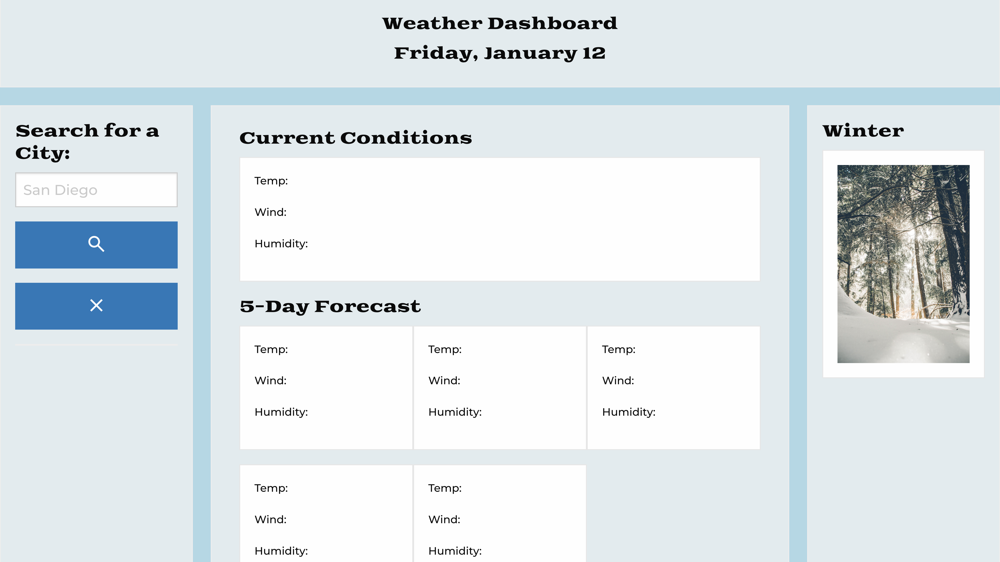
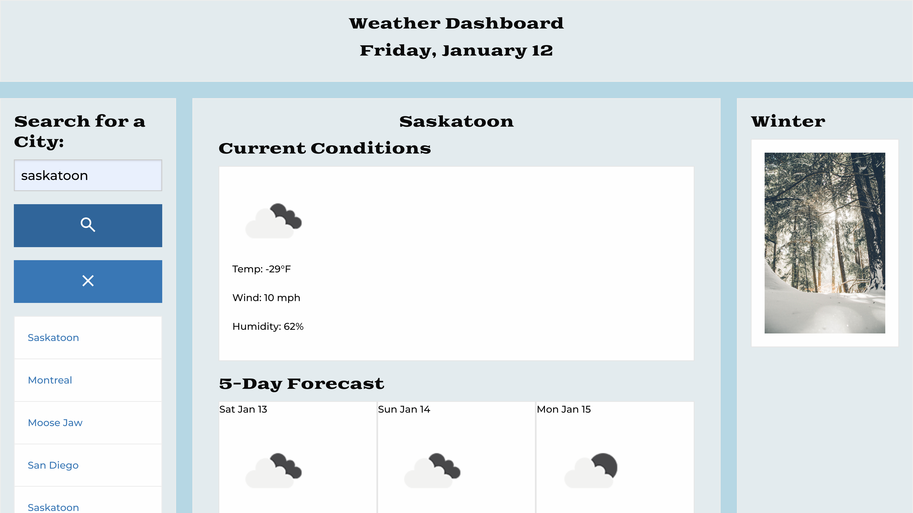

# weather-dashboard

## Description

This is a weather dashboard that runs in the browser and features dynamically updated HTML and CSS. It provides the current weather (temperature, wind speed and humidity) as well as the forecast for the next 5 days.

It provides a quick and simple ad-free interface for discovering the weather forecast.

I tried adding sunrise and sunset times, but was having trouble figuring out the time shift to get it in local time, so I have saved that for future development as well as a placeholder for a dynamic image that changes with the weather and/or season. I would also like to add a better search input that will accept states, countries, zip codes, etc. to ensure you are getting the correct city returned (i.e. London, Ontario or London, England). One final improvement I would like to make would be to include the weather information for previously searched cities in local storage so I am not re-fetching the information from the API.

## Installation

The website is deployed here: ![https://kerilsen.github.io/weather-dashboard] (https://kerilsen.github.io/weather-dashboard)

## Usage

After navigating to the site, this is the landing page:

You type in the name of the city you would like to search and press the search button. You are provided with the current forecast as well as a five day forecast for that city. A clickable search history is shown along the left side of the screen (at the top on a mobile device) if you would like to show a previous result again.

## Credits

N/A

## License

Please refer to license in repo.